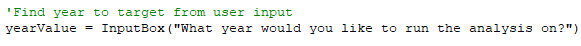
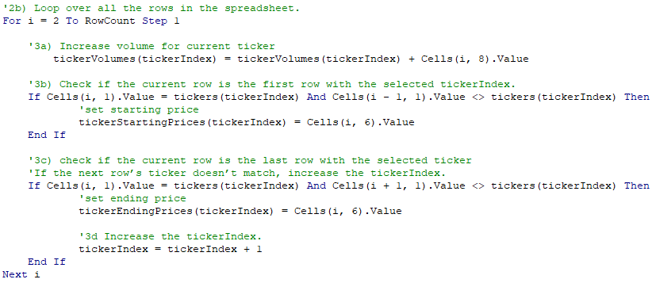
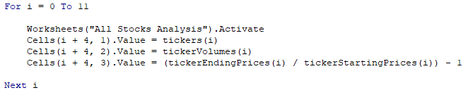
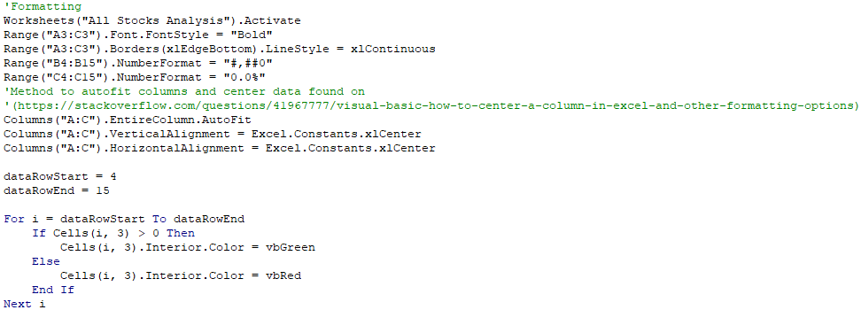
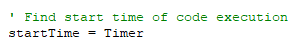
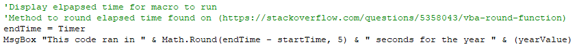
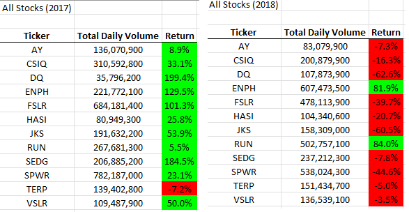
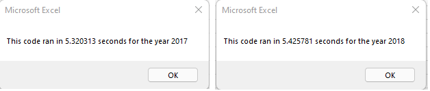
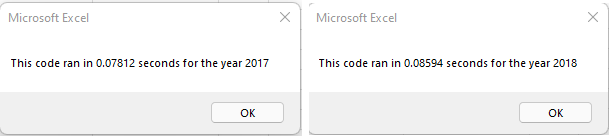

#  Project - Stock Analysis (Module 2 Challenge)

## Overview
The purpose of this project was to refactor the code built up throughout the module to increase it's performance as well as provide a stock performance analysis for 2017 and 2018.

## Results
VBA code was used to request the user enter the year that is to be analyzed.

A For-Next loop was then used to loop through the data to determine which ticker was being read as well as what it's start and ending prices were. These were then stored in appropriate array elements.

Once the loop was run, another For-Next loop stepped through the loaded arrays and posted the data into appropriate columns on th eAll Stocks Analysis worksheet.

After posting the results, formatting was applied to the columns to create a more professional look as well as yet another For_Next loop was used to conditionally format the results to facillitate at-a-glance results assessment.

Finally, a message box was popped up to display the elapsed time for code execution. Use of the VBA Timer method facilitated this at the beginning and end of the executed code.

#### This code is at the beginning of the script.

#### This code is at the end of the script.

After executing the script for for years or data (2017 & 2018), the output was asessed. The outputs for both years are shown side by side below.

## Results of stock analysis

Viewing the output, one can easily see that in 2017, there was likely a bull market allowing positive performance on most stocks with DQ and SEDG leading the pack by a significant margin. However, 2018 tells a very different story as most stock showed negative performance indicating the onset of a bear market. Comparing the two side by side one can see that the only two stocks to remain positive throughout the entire data set were ENPH and RUN. Further examination reveals that, though both remained positive, ENPH was the most favorable of the two in over returns indicating, due to relative consistancy in varied market conditions, ENPH would be the wisest investment.

## Results of refactoring code
The images below demostrate the execution times prior to refactoring the script.

The images below demonstrate the execution times after refactoring the sccript.

The above images clearly indicate that the refcatoring of the code significantly reduced the execution time of th escript. 

## Summary

To summarize, refactoring the script has the advantage of significantly reducing the execution time. However, refactoring into a single monolithic script reduces the ability as a program to have "canned" code snippits stored offline for compartmentalized coding. It would be worthwhile to experiment with passing arguments between compartmetalized code and run one script with a series of VBA Call statements to execute the code in the correct order.

With respect to refactoring the original script, due to the significant reduction in execution time, it was well worth combinning into one large script.

